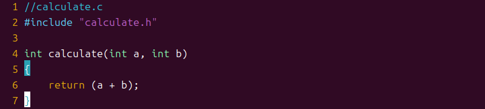

Linux C语言编程基础

郭一波

在 Windows 系统中，开发人员可以使用各种强大的集成开发环境（IDE），比如 Visual Studio，来进行编程。在 Linux 系统中，如 Ubuntu、CentOS、Debian、Fedora 等发行版，它们都是基于 Linux 内核构建，提供了各种工具和软件来形成完整的操作系统环境。不同的 Linux 发行版根据设计目标和功能有所区别，其中 Ubuntu 以其用户友好性著称。那么，在 Ubuntu 上进行编程是如何实现的呢？

Ubuntu 提供了多个编程工具，其中很多是文本编辑器，能够帮助用户编写代码。然而，若要进行编译工作，Ubuntu 通常依赖于 GCC 编译器。为了更高效地管理代码的编译过程，通常会使用 Makefile 来自动化编译流程。因此，本章将介绍如何在 Ubuntu 上进行 C 语言的编程、如何使用 GCC 编译器以及如何编写和使用 Makefile。通过学习本章内容，读者将掌握在 Linux 环境下进行 C 编程的基本技巧，并为进一步的学习打下坚实的基础。

1.1 Hello World！

编写代码包括两部分：代码编写和编译，在 Windows 下可以使用 Visual Studio来完成这两部分，可以在 Visual Studio 下编写代码然后直接点击编译就可以了。但是在 Linux下这两部分是分开的，比如我们用 VIM 进行代码编写，编写完成以后再使用 GCC 编译器进行编译，其中代码编写工具很多，比如 VIM 编辑器、 Emacs 编辑器、 VScode 编辑器等等，本章使用 Ubuntu 自带的 VIM 编辑器。先来编写一个最简单的“Hello World”程序，把 Linux 下的 C 编程完整的走一遍。

1.1.1 编写代码

先在用户根目录下创建一个工作文件夹： C_Program，所有的 C 语言练习都保存到这个工作文件夹下，创建过程如图 1.1.1 所示：

图 1.1.1 创建工作目录

创建一个名为“1.1”的文件夹来保存我们的“Hello World”程序相关的文件，操作如图 1.1.2 所示：

图 1.1.2 创建工程文件夹

前面说了我们使用 VI 编辑器，在使用 VI 编辑器之前我们先做如下设置：

1、设置 TAB 键为 4 字节

VI 编辑器默认 TAB 键为 8 空格，我们改成 4 空格，用 vi 打开文件/etc/vim/vimrc，在此文件最后面输入如下代码：

set ts=4

添加完成如图 1.1.3 所示：

图 1.1.3 设置 TAB 为四个空格

修改完成以后保存并关闭文件。

2、 VIM 编辑器显示行号

VIM 编辑器默认是不显示行号的，不显示行号不利于代码查看，我们设置 VIM 编辑器显示行号，同样是通过在文件/etc/vim/vimrc 中添加代码来实现，在文件最后面加入下面一行代码即可：

set nu

添加完成以后的/etc/vim/vimrc 文件如图 1.1.4 所示：

图 1.1.4 设置 VIM 编辑器显示行号

VIM 编辑器可以自行定制，网上有很多的博客讲解如何设置 VIM，感兴趣的可以在网上搜索。设置好 VIM 编辑器以后就可以正式开始编写代码了，进入前面创建的“1.1”这个工程文件夹里面，使用 vi 指令创建一个名为“main.c”的文件，然后在里面输入如下代码：

/\*1.1.1 main.c 文件代码\*/

\#include \<stdio.h\>

int main(int argc, char \*argv[])

{

printf("Hello World!\\n");

}

编写完成以后保存退出 vi 编辑器，可以使用“cat”命令查看代码是否编写成功，如图 1.1.5 所示：

图 1.1.5 查阅程序源码

从图 1.1.5 可以看出 main.c 文件编辑完成，代码编辑完成以后我们需要对其进行编译。

1.2 编译代码

Ubuntu 下的 C 语言编译器是GCC,GCC编译器在我们安装Ubuntu的时候就已经默认安装好了，可以通过如下命令查看 GCC 编译器的版本号：

gcc -v

在终端中输入上述命令以后终端输出如图 1.2.1 所示：

图 3.1.2.1 gcc 版本查询

如果输入命令“gcc -v”命令以后，你的终端输出类似图1.2.1中的信息，那么说明你的电脑已经有 GCC 编译器了。最后下面的“gcc version 13.2.0”说明本机的 GCC 编译器版本为 13.2.0的。注意观察在图 1.2.1 中有“Target: x86_64-linux-gnu”一行，这说明 Ubuntu 自带的 GCC 编译器是针对 X86 架构的，因此只能编译在 X86 架构 CPU 上运行的程序。如果想要编译在 ARM上运行的程序就需要针对 ARM 的 GCC 编译器，也就是交叉编译器！我们是 ARM 开发，因此肯定要安装针对 ARM 架构的 GCC 交叉编译器，当然了，这是后面的事，现在我们不用管这些，只要知道不同的目标架构，其 GCC 编译器是不同的。

如何使用 GCC 编译器来编译 main.c 文件呢？ GCC 编译器是命令模式的，因此需要输入命令来使用 gcc 编译器来编译文件，输入如下命令：

gcc main.c

上述命令的功能就是使用 gcc 编译器来编译 main.c 这个 c 文件，过程如图1.2.2 所示：

图 1.2.2 编译 main.c 文件

在图 1.2.2 中可以看到，当编译完成以后会生成一个 a.out 文件，这个 a.out 就是编译生成的可执行文件，执行此文件看看是否和我们代码的功能一样，执行的方法很简单使用命令：“./+可执行文件”，比如本例程就是命令： ./a.out，操作如图 1.2.3 所示：

图 1.2.3 执行编译得到的文件

在图 3.1.2.3 中执行 a.out 文件以后终端输出了“Hello World！”，这正是 main.c 要实现的功能，说明我们的程序没有错误。 a.out 这个文件的命名是 GCC 编译器自动命名的，那我们能不能决定编译完生成的可执行文件名字呢？肯定可以的，在使用 gcc 命令的时候加上-o 来指定生成的可执行文件名字，比如编译 main.c 以后生成名为“main”的可执行文件，操作如图 1.2.4所示：

图 1.2.4 指定可执行文件名字

在图 1.2.4 中，我们使用“gcc main.c –o main”来编译 main.c 文件，使用参数“-o”来指定

编译生成的可执行文件名字，至此我们就完成 Linux 下 C 编程和编译的一整套过程。

1.2 GCC 编译器

1.2.1 gcc 命令

在上一小节我们已经使用过 GCC 编译器来编译 C 文件了，我们使用到是 gcc 命令， gcc 命令格式如下：

gcc [选项] [文件名字]

主要选项如下：

\-c： 只编译不链接为可执行文件，编译器将输入的.c 文件编译为.o 的目标文件。

\-o： \<输出文件名\>用来指定编译结束以后的输出文件名，如果不使用这个选项的话 GCC 默认编译出来的可执行文件名字为 a.out。

\-g： 添加调试信息，如果要使用调试工具(如 GDB)的话就必须加入此选项，此选项指示编译的时候生成调试所需的符号信息。

\-O： 对程序进行优化编译，如果使用此选项的话整个源代码在编译、链接的的时候都会进行优化，这样产生的可执行文件执行效率就高。

\-O2： 比-O 更幅度更大的优化，生成的可执行效率更高，但是整个编译过程会很慢。

1.2.2 编译错误警告

在 Windows 下不管我们用啥编译器，如果程序有语法错误，那么编译的时候都会指示出来，比如开发 STM32 的时候所使用的 MDK 和 IAR，我们可以根据错误信息方便的修改 bug。那GCC 编译器有没有错误提示呢？肯定是有的，我们可以测试一下，新名为“2.2”的文件夹，使用 vi 在文件夹“2.2”中创建一个 main.c 文件，在文件里面输入如下代码：

示例代码 1.2.2 main.c 文件代码

\#include \<stdio.h\>

int main(int argc, char \*argv[])

{

int a, b;

a = 3;

b = 4；

printf("a+b=\\n", a + b)

}

在上述代码中有一处错误：第 7 行“printf("a+b=\\n", a + b)”少写了个一个“；”号。

我们编译一下上述代码，看看 GCC 编译器是否能够检查出错误，编译结果如图 1.2.2.1 所示：

图 1.2.2.1 错误提示

从图 1.2.2 中可以看出有一个 error，提示在 main.c 文件的第 9 行有错误，错误类型是在printf 后没有“；”号，添加符号后编译文件，如图 1.2.2.2 所示：

图 1.2.2.2 编译成功

在图 1.2.2.2 中我们编译成功，生成了可执行文件 main，执行一下 main，看看结果和我们设计的是否一样，如图 1.2.2.3 所示：

图 1.2.2.3 执行结果

可以看出， GCC 编译器和其它编译器一样，不仅能够检测出错误类型，而且标记除了错误发生在哪个文件、哪一行，方便我们去修改代码。

1.2.3 编译流程

GCC 编译器的编译流程是：预处理、编译、汇编和链接。

预处理：展开所有的头文件、替换程序中的宏、解析条件编译并添加到文件中。

编译：将经过预编译处理的代码编译成汇编代码，也就是我们常说的程序编译。

汇编：将汇编语言文件编译成二进制目标文件。

链接：将汇编出来的多个二进制目标文件链接在一起，形成最终的可执行文件，链接的时候还会涉及到静态库和动态库等问题。

上一小节演示的例程都只有一个文件，而且文件非常简单，因此可以直接使用 gcc 命令生成可执行文件，并没有先将 c 文件编译成.o 文件，然后再链接在一起。

1.3 Makefile 基础

1.3.1 何为 Makefile

在上一小节中，我们介绍了如何使用 GCC 编译器在 Linux 系统中进行 C 语言编译。通过在终端执行 gcc 命令，我们可以将 C 文件编译成可执行文件。如果工程只有一两个 C 文件，手动输入命令还不算麻烦，但当工程中有成百上千个源文件时，手动输入每个文件的编译命令就变得不切实际了。这时，我们就需要一种方法来自动化这些编译任务。

这里的解决方案就是 Makefile 文件。Makefile 是一种用于描述 C/C++ 项目编译规则的脚本文件，它能够自动化整个编译过程。通过编写 Makefile 文件，开发者只需要执行一个 make 命令，就可以完成整个工程的编译过程，而不再需要手动输入每条 GCC 命令。

对于一个中大型的 C/C++ 工程，源文件的数量可能会非常庞大，这些文件通常根据功能、模块或类型被组织在不同的目录中。Makefile 文件就起到了指引的作用，它通过一系列的规则，定义了源文件的编译顺序、文件之间的依赖关系，以及何时需要重新编译等信息。这样，当源代码发生改变时，Makefile 会自动决定哪些文件需要重新编译，避免了重复编译没有改动的文件，从而提高编译效率。

对于大家常用的集成开发环境（IDE）来说，它们通常已经封装了这些编译规则和功能，通过图形化界面来简化编译过程。而在 Linux 系统中，常用的 GCC 编译器并没有图形界面，因此开发者需要自己编写 Makefile 文件，来自动化管理整个编译过程。Makefile 的使用不仅能帮助我们更高效地管理项目，还能减少人为错误，提高开发效率。

由于 Makefile 的知识比较多，完全可以单独写本书，因此本章我们只讲解 Makefile 基础入门，如果想详细的研究 Makefile，请查阅相关书籍。

1.3.2 Makefile 示例

这里示例为实现键盘输入两个整形数字，最后输出结果为二者之和，文件内容如下：

Main.c:

Input.c:

Input.h:

Calculate.c:

Calculate.h:

在终端输入如下命令：

gcc main.c calculate.c input.c -o main

上面命令的意思就是使用 gcc 编译器对 main.c、calculate.c 和 input.c 这三个文件进行编译，编译生成的可执行文件叫做 main。编译完成以后执行 main 这个程序，测试一下软件是否工作正常，结果如图 1.3.2 所示：

图 1.3.2 程序测试

如果文件数量少可以使用上述方法编译，但如果文件数量庞大，需要编译每一个文件并链接，或是仅编译修改过的文件并关联到每一个相关文件，那么就要使用 MakeFile ，创建MakeFile文件：

图 1.3.2 Makefile 源码

输入make运行即可：

图 1.3.2Make 编译工程

编译完成以后就会在当前工程目录下生成各种.o 和可执行文件，说明我们编译成功了。

1.4 Makefile 语法

1.4.1 Makefile 规则格式

Makefile 里面是由一系列的规则组成的，这些规则格式如下：

目标…... : 依赖文件集合……

命令 1

命令 2

……

比如下面这条规则：

main : main.o input.o calculate.o

gcc -o main main.o input.o calculate.o

这条规则的目标是 main，main.o、input.o 和 calculate.o 是生成 main 的依赖文件，如果要更新目标 main，就必须先更新它的所有依赖文件，如果依赖文件中的任何一个有更新，那么目标也必须更新，“更新”就是执行一遍规则中的命令列表。

命令列表中的每条命令必须以 TAB 键开始，不能使用空格！

make 命令会为 Makefile 中的每个以 TAB 开始的命令创建一个 Shell 进程去执行。

了解了 Makefile 的基本运行规则以后我们再来分析一下 3.3 节中的Makefile，代码如下：

main: main.o input.o calculate.o

gcc -o main main.o input.o calculate.o

main.o: main.c

gcc -c main.c

input.o: input.c

gcc -c input.c

calculate.o: calculate.c

gcc -c calculate.c

clean:

rm \*.o

rm main

上述代码中一共有 5 条规则，1\~2 行为第一条规则，3\~4 行为第二条规则，5\~6 行为第三条规则，7\~8 行为第四条规则，10\~12 为第五条规则，make 命令在执行这个 Makefile 的时候其执行步骤如下：

首先更新第一条规则中的 main，第一条规则的目标成为默认目标，只要默认目标更新了规则会执行，第一条规则依赖于文件 main.o、input.o 和 calculate.o 这个三个.o 文件，这三个.o 文件目前还都没有，因此必须先更新这三个文件。make 会查找以这三个.o 文件为目标的规则并执行。以 main.o为例，发现更新 main.o 的是第二条规则，因此会执行第二条规则，第二条规则里面的命令为“gcc–c main.c”，这行命令很熟悉了吧，就是不链接编译 main.c，生成 main.o，其它两个.o 文件同理。最后一个规则目标是 clean，它没有依赖文件，因此会默认为依赖文件都是最新的，所以其对应的命令不会执行，当我们想要执行 clean 的话可以直接使用命令“make clean”，执行以后就会删除当前目录下所有的.o 文件以及 main，因此 clean 的功能就是完成工程的清理。

我们在来总结一下 Make 的执行过程：

1、make 命令会在当前目录下查找以 Makefile(makefile 其实也可以)命名的文件。

2、当找到 Makefile 文件以后就会按照 Makefile 中定义的规则去编译生成最终的目标文件。

3、当发现目标文件不存在，或者目标所依赖的文件比目标文件新(也就是最后修改时间比

目标文件晚)的话就会执行后面的命令来更新目标。

这就是 make 的执行过程，make 工具就是在 Makefile 中一层一层的查找依赖关系，并执行相应的命令。编译出最终的可执行文件。Makefile 的好处就是“自动化编译”，一旦写好了 Makefile文件，以后只需要一个 make 命令即可完成整个工程的编译，极大的提高了开发效率。

总结一下，Makefile 中规则用来描述在什么情况下使用什么命令来构建一个特定的文件，这个文件就是规则的“目标”，为了生成这个“目标”而作为材料的其它文件称为“目标”的依赖，规则的命令是用来创建或者更新目标的。除了 Makefile 的“终极目标”所在的规则以外，其它规则的顺序在 Makefile 中是没有意义的，“终极目标”就是指在使用 make 命令的时候没有指定具体的目标时，make 默认的那个目标，它是 Makefile 文件中第一个规则的目标，如果 Makefile 中的第一个规则有多个目标，那么这些目标中的第一个目标就是 make 的“终极目标”

。

1.4.2 Makefile 变量

跟 C 语言一样 Makefile 也支持变量的，先看一下前面的例子： main: main.o input.o calculate.o

gcc -o main main.o input.o calculate.o

上述 Makefile 语句中， main.o input.o 和 calculate.o 这三个依赖文件，我们输入了两遍，我们这个 Makefile 比较小，如果 Makefile 复杂的时候这种重复输入的工作就会非常费时间，而且非常容易输错，为了解决这个问题， Makefile 加入了变量支持。不像 C 语言中的变量有 int、 char等各种类型， Makefile 中的变量都是字符串！类似 C 语言中的宏。使用变量将上面的代码修改，修改以后如下所示：

示例代码 1.4.2 Makefile 变量使用

1 \#Makefile 变量的使用

2 objects = main.o input.o calculate.o

3 main: \$(objects)

4 gcc -o main \$(objects)

我们来分析一下“示例代码 1.4.2”，第 1 行是注释， Makefile 中可以写注释，注释开头要用符号“\#”，不能用 C 语言中的“//”或者“/\*\*/”！第 2 行我们定义了一个变量 objects，并且给这个变量进行了赋值，其值为字符串“main.o input.o calculate.o”，第 3 和 4行使用到了变量 objects， Makefile 中变量的引用方法是“\$(变量名)”，比如本例中的“\$(objects)”就是使用变量 objects。

在“示例代码 1.4.2”中我们在定义变量 objects 的时候使用“=”对其进行了赋值， Makefile变量的赋值符还有其它两个“:=”和“?=”，我们来看一下这三种赋值符的区别：

1、赋值符“=”

使用“=”在给变量的赋值的时候，不一定要用已经定义好的值，也可以使用后面定义的值，比如如下代码：

示例代码 1.4.2 赋值符"="使用

name = rango

curname = \$(name)

name = Vladimirovichi

print:

@echo curname: \$(curname)

我们来分析一下上述代码，第 1 行定义了一个变量 name，变量值为“rango”，第 2 行也定义了一个变量curname， curname的变量值引用了变量name，按照我们C写语言的经验此时curname的值就是“rango”。第 3 行将变量 name 的值改为了“Vladimirovichi”，第 5、 6 行是输出变量 curname的值。在 Makefile 要输出一串字符的话使用“echo”，就和 C 语言中的“printf”一样，第 6 行中的“echo”前面加了个“@”符号，因为 Make 在执行的过程中会自动输出命令执行过程，在命令前面加上“@”的话就不会输出命令执行过程，大家可以测试一下不加“@”的效果。使用命令“make print”来执行上述代码，执行结果中可以看到curname的值不是“rango”，竟然是“Vladimirovichi”，也就是变量“name”最后一次赋值的结果，这就是赋值符“=”的神奇之处！借助另外一个变量，可以将变量的真实值推到后面去定义。也就是变量的真实值取决于它所引用的变量的最后一次有效值。

2、赋值符“:=”

在“示例代码 1.4.2” 上来测试赋值符“:=”，修改“示例代码 1.4.2”中的第 2 行，将其中的“=”改为“:=”，修改完成以后的代码如下：

示例代码 1.4.2 ":="的使用

name = rango

curname := \$(name)

name = Vladimirovichi

print:

@echo curname: \$(curname)

执行结果中可以看到此时的 curname 是 rango，不是 Vladimirovichi 了。这是因为赋值符“:=”不会使用后面定义的变量，只能使用前面已经定义好的，这就是“=”和“:=”两个的区别。

3、赋值符“?=”

“?=”是一个很有用的赋值符，比如下面这行代码： curname ?= Vladimirovichi

上述代码的意思就是，如果变量 curname 前面没有被赋值，那么此变量就是“Vladimirovichi”，如果前面已经赋过值了，那么就使用前面赋的值。

4、变量追加“+=”

Makefile 中的变量是字符串，有时候我们需要给前面已经定义好的变量添加一些字符串进去，此时就要使用到符号“+=”，比如如下所示代码：

objects = main.o inpiut.o objects += calculate.o

一开始变量 objects 的值为“main.o input.o”，后面我们给他追加了一个“calculate.o”，因此变量 objects 变成了“main.o input.o calculate.o”，这个就是变量的追加。

1.4.3 Makefile 模式规则

在 1.3.2 小节中我们编写了一个 Makefile 文件用来编译工程，这个 Makefile 的内容如下：

示例代码 1.4.3.1 Makefile 文件代码

main: main.o input.o calculate.o

gcc -o main main.o input.o calculate.o

main.o: main.c

gcc -c main.c

input.o: input.c

gcc -c input.c

calculate.o: calculate.c

gcc -c calculate.c

clean:

rm \*.o

rm main

上述 Makefile 中第 3\~8 行是将对应的.c 源文件编译为.o 文件，每一个 C 文件都要写一个对应的规则，如果工程中 C 文件很多的话显然不能这么做。为此，我们可以使用 Makefile 中的模式规则，通过模式规则我们就可以使用一条规则来将所有的.c 文件编译为对应的.o 文件。

模式规则中，至少在规则的目标定定义中要包涵“%”，否则就是一般规则，目标中的“%”表示对文件名的匹配，“%”表示长度任意的非空字符串，比如“%.c”就是所有的以.c 结尾的文件，类似与通配符， a.%.c 就表示以 a.开头，以.c 结束的所有文件。

当“%”出现在目标中的时候，目标中“%”所代表的值决定了依赖中的“%”值，使用方法如下：

%.o : %.c

命令

因此“示例代码 1.4.3.1”中的 Makefile 可以改为如下形式：

示例代码 1.4.3.2 模式规则使用

objects = main.o input.o calculate.o

main: \$(objects)

gcc -o main \$(objects)

%.o : %.c

\#命令

clean:

rm \*.o

rm main

“示例代码 1.4.3.2”中第 5、 6 这两行代码替代了“示例代码 1.4.3.1”中的 3\~8 行代码，修改以后的 Makefile 还不能运行，因为第 6 行的命令我们还没写呢，第 6 行的命令我们需要借助另外一种强大的变量—自动化变量。

3.4.4 Makefile 自动化变量

上面讲的模式规则中，目标和依赖都是一系列的文件，每一次对模式规则进行解析的时候都会是不同的目标和依赖文件，而命令只有一行，如何通过一行命令来从不同的依赖文件中生成对应的目标？自动化变量就是完成这个功能的！所谓自动化变量就是这种变量会把模式中所定义的一系列的文件自动的挨个取出，直至所有的符合模式的文件都取完，自动化变量只应该出现在规则的命令中，常用的自动化变量如表 1.4.4.1：

| 自动化变量 | 描述                                                                                                              |
|------------|-------------------------------------------------------------------------------------------------------------------|
| \$@        | 规则中的目标集合，在模式规则中，如果有多个目标的话，“\$@”表示匹配模式中定义的目标集合。                           |
| \$%        | 当目标是函数库的时候表示规则中的目标成员名，如果目标不是函数库文件，那么其值为空。                                |
| \$\<       | 依赖文件集合中的第一个文件，如果依赖文件是以模式(即“%” )定义的，那么“\$\<”就是符合模式的一系列的文件集合。        |
| \$?        | 所有比目标新的依赖目标集合，以空格分开。                                                                          |
| \$\^       | 所有依赖文件的集合，使用空格分开，如果在依赖文件中有多个重复的文件， “\$\^”会去除重复的依赖文件，值保留一份。     |
| \$+        | 和“\$\^”类似，但是当依赖文件存在重复的话不会去除重复的依赖文件。                                                  |
| \$\*       | 这个变量表示目标模式中"%"及其之前的部分，如果目标是 test/a.test.c，目标模式为 a.%.c，那么“\$\*”就是 test/a.test。 |

表 1.4.4.1 自动化变量

表 1.4.4.1 中的 7 个自动化变量中，常用的三种： \$@、 \$\<和\$\^，我们使用自动化变量来完成“示例代码 1.4.3.2”中的 Makefile，最终的完整代码如下所示：

示例代码 1.4.4.1 自动化变量

objects = main.o input.o calculate.o

main: \$(objects)

gcc -o main \$(objects)

%.o : %.c

gcc -c \$\<

clean:

rm \*.o

rm main

上述代码代码就是修改后的完成的 Makefile，可以看出相比 1.3.2 小节中的要精简了很多，核心就在于第 5、 6 这两行，第 5 行使用了模式规则，第 6 行使用了自动化变量。

1.4.5 Makefile 伪目标

Makefile 有一种特殊的目标——伪目标，一般的目标名都是要生成的文件，而伪目标不代表真正的目标名，在执行 make 命令的时候通过指定这个伪目标来执行其所在规则的定义的命令。

使用伪目标主要是为了避免 Makefile 中定义的执行命令的目标和工作目录下的实际文件出现名字冲突，有时候我们需要编写一个规则用来执行一些命令，但是这个规则不是用来创建文件的，比如在前面的“示例代码 3.4.4.1”中有如下代码用来完成清理工程的功能：

clean: rm \*.o rm main

上述规则中并没有创建文件 clean 的命令，因此工作目录下永远都不会存在文件 clean，当我们输入“make clean”以后，后面的“rm \*.o”和“rm main”总是会执行。可是如果我们“手贱”，在工作目录下创建一个名为“clean”的文件，那就不一样了，当执行“make clean”的时候，规则因为没有依赖文件，所以目标被认为是最新的，因此后面的 rm 命令也就不会执行，我们预先设想的清理工程的功能也就无法完成。为了避免这个问题，我们可以将 clean 声明为伪目标，声明方式如下：

.PHONY : clean

我们使用伪目标来更改“示例代码 1.4.4.1”，修改完成以后如下：

示例代码 1.4.5.1 伪目标

objects = main.o input.o calculate.o

main: \$(objects)

gcc -o main \$(objects)

.PHONY : clean

%.o : %.c

gcc -c \$\<

clean:

rm \*.o

rm main

上述代码第 5 行声明 clean 为伪目标，声明 clean 为伪目标以后不管当前目录下是否存在名为“clean”的文件，输入“make clean”的话规则后面的 rm 命令都会执行。

3.4.6 Makefile 条件判断

在 C 语言中我们通过条件判断语句来根据不同的情况来执行不同的分支， Makefile 也支持条件判断，语法有两种如下：

\<条件关键字\>

\<条件为真时执行的语句\>

Endif

以及：

\<条件关键字\>

\<条件为真时执行的语句\>

else

\<条件为假时执行的语句\>

endif

其中条件关键字有 4 个： ifeq、 ifneq、 ifdef 和 ifndef，这四个关键字其实分为两对、 ifeq 与ifneq、 ifdef 与 ifndef，先来看一下 ifeq 和 ifneq， ifeq 用来判断是否相等， ifneq 就是判断是否不相等， ifeq 用法如下：

ifeq (\<参数 1\>, \<参数 2\>)

ifeq ‘\<参数 1 \>’ ,‘ \<参数 2\>’

ifeq “\<参数 1\>” , “\<参数 2\>”

ifeq “\<参数 1\>” , ‘\<参数 2\>’

ifeq ‘\<参数 1\>’ , “\<参数 2\>”

上述用法中都是用来比较“参数 1”和“参数 2”是否相同，如果相同则为真，“参数 1”和“参数 2”可以为函数返回值。 ifneq 的用法类似，只不过 ifneq 是用来了比较“参数 1”和“参数 2”是否不相等，如果不相等的话就为真。

ifdef 和 ifndef 的用法如下：

ifdef \<变量名\>

如果“变量名”的值非空，那么表示表达式为真，否则表达式为假。“变量名”同样可以是一个函数的返回值。 ifndef 用法类似，但是含义用户 ifdef 相反。

1.4.7 Makefile 函数使用

Makefile 支持函数，类似 C 语言一样， Makefile 中的函数是已经定义好的，我们直接使用，不支持我们自定义函数。 make 所支持的函数不多，但是绝对够我们使用了，函数的用法如下：

\$(函数名 参数集合)

或者：

\${函数名 参数集合}

可以看出，调用函数和调用普通变量一样，使用符号“\$”来标识。参数集合是函数的多个参数，参数之间以逗号“,”隔开，函数名和参数之间以“空格”分隔开，函数的调用以“\$”开头。接下来我们介绍几个常用的函数，其它的函数大家可以参考《跟我一起写 Makefile》这份文档。

1、函数 subst

函数 subst 用来完成字符串替换，调用形式如下：

\$(subst \<from\>,\<to\>,\<text\>)

此函数的功能是将字符串\<text\>中的\<from\>内容替换为\<to\>，函数返回被替换以后的字符串，比如如下示例：

\$(subst rango,RANGO,my name is rango)

把字符串“my name is rango”中的“rango”替换为“RANGO”，替换完成以后的字符串为“my name is RANGO”。

2、函数 patsubst

函数 patsubst 用来完成模式字符串替换，使用方法如下：

\$(patsubst \<pattern\>,\<replacement\>,\<text\>)

此函数查找字符串\<text\>中的单词是否符合模式\<pattern\>，如果匹配就用\<replacement\>来替换掉， \<pattern\>可以使用通配符“%”，表示任意长度的字符串，函数返回值就是替换后的字符串。如果\<replacement\>中也包涵“%”，那么\<replacement\>中的“%”将是\<pattern\>中的那个“%”所代表的字符串，比如：

\$(patsubst %.c,%.o,a.c b.c c.c)

将字符串“a.c b.c c.c”中的所有符合“%.c”的字符串，替换为“%.o”，替换完成以后的字符串为“a.o b.o c.o”。

3、函数 dir

函数 dir 用来获取目录，使用方法如下：

\$(dir \<names…\>)

此函数用来从文件名序列\<names\>中提取出目录部分，返回值是文件名序列\<names\>的目录部分，比如：

\$(dir \</src/a.c\>)

提取文件“/src/a.c”的目录部分，也就是“/src”。

4、函数 notdir

函数 notdir 看名字就是知道去除文件中的目录部分，也就是提取文件名，用法如下： \$(notdir \<names…\>)

此函数用与从文件名序列\<names\>中提取出文件名非目录部分，比如：

\$(notdir \</src/a.c\>)

提取文件“/src/a.c”中的非目录部分，也就是文件名“a.c”。

5、函数 foreach

foreach 函数用来完成循环，用法如下：

\$(foreach \<var\>, \<list\>,\<text\>)

此函数的意思就是把参数\<list\>中的单词逐一取出来放到参数\<var\>中，然后再执行\<text\>所包含的表达式。每次\<text\>都会返回一个字符串，循环的过程中， \<text\>中所包含的每个字符串会以空格隔开，最后当整个循环结束时， \<text\>所返回的每个字符串所组成的整个字符串将会是函数 foreach 函数的返回值。

6、函数 wildcard

通配符“%”只能用在规则中，只有在规则中它才会展开，如果在变量定义和函数使用时，通配符不会自动展开，这个时候就要用到函数 wildcard，使用方法如下：

\$(wildcard PATTERN…)比如：

\$(wildcard \*.c)

上面的代码是用来获取当前目录下所有的.c 文件，类似“%”。

关于 Makefile 的相关内容就讲解到这里，本节只是对 Makefile 做了最基本的讲解，确保大家能够完成后续的学习。

Linux与STM32串口通信：

/dev 目录：

dev 是 device 的缩写，所以此目录下的文件都是和设备有关的，此目录下的文件都是设备文件。在Linux下一切皆文件，即使是硬件设备，也是以文件的形式存在的，比如/dev/ttymxc0(I.MX6ULL 根目录会有此文件)就表示 I.MX6ULL 的串口 0，我们要想通过串口0发送或者接收数据就要操作文件/dev/ttymxc0通过对文件/dev/ttymxc0 的读写操作来实现串口0 的数据收发。

在 Linux 下终端的设备文件都位于/dev/目录下，以 tty\*开头的字符命名，可使用如下命令查看：

ls /dev/tty\*

可以看到有个名为“ttymxc0”的设备，“ttymxc0”就是开发板的串口 1，它已被默认被用在命令行的终端上。

stty 命令,用于显示或设置终端的各种参数，如波特率、字符大小、奇偶校验、停止位等。

\#输出当前终端参数

stty

\#查看ttymxc0的参数

stty -F /dev/ttymxc0

\#设置通讯速率，其中ispeed为输入速率，ospeed为输出速率

stty -F /dev/ttymxc0 ispeed 115200 ospeed 115200

2.命令行串口通信

使用 Type-C 接口的数据线连接开发板和 PC

打开 MobaXterm 终端

设置波特率，根据第一步的 stty 命令中得到的 ttymxc0 的波特率

如果开发板已经连接 WiFi，在开发板上使用 ifconfig 命令查看 ip 地址

在 Windows 或 Ubuntu 中使用 ssh 命令连接开发板ssh debian@192.168.31.xxx  
以下命令在 ssh 终端中执行

echo "Hello" \> /dev/ttymxc0

然后将会在 MobaXterm 终端中看到 Hello，如下图。  
左为 ssh 终端，右为 MobaXterm 终端  

Linux 下的串口调试工具

minicom

\#安装minicom

sudo apt-get install minicom

\#打开minicom设置

sudo minicom -s

设置界面如下图  
  
串口设置界面如下图  
  
进入 minicom

sudo minicom

串口通信实验代码

串口通信实验代码

\#include \<stdio.h\>

\#include \<stdlib.h\>

\#include \<unistd.h\>

\#include \<fcntl.h\>

\#include \<sys/stat.h\>

\#include \<sys/types.h\>

\#include \<termios.h\>

\#include \<string.h\>

\#include \<sys/ioctl.h\>

/第一部分代码/

//根据具体的设备修改

const char default_path[] = "/dev/ttymxc2";

// const char default_path[] = "/dev/ttymxc2";

int main(int argc, char \*argv[])

{

int fd;

int res;

char \*path;

char buf[1024] = "Embedfire tty send test.\\n";

/第二部分代码/

//若无输入参数则使用默认终端设备

if (argc \> 1)

path = argv[1];

else

path = (char \*)default_path;

//获取串口设备描述符

printf("This is tty/usart demo.\\n");

fd = open(path, O_RDWR);

if (fd \< 0) {

printf("Fail to Open %s device\\n", path);

return 0;

}

/第三部分代码/

struct termios opt;

//清空串口接收缓冲区

tcflush(fd, TCIOFLUSH);

// 获取串口参数opt

tcgetattr(fd, \&opt);

//设置串口输出波特率

cfsetospeed(&opt, B9600);

//设置串口输入波特率

cfsetispeed(&opt, B9600);

//设置数据位数

opt.c_cflag &= \~CSIZE;

opt.c_cflag \|= CS8;

//校验位

opt.c_cflag &= \~PARENB;

opt.c_iflag &= \~INPCK;

//设置停止位

opt.c_cflag &= \~CSTOPB;

//更新配置

tcsetattr(fd, TCSANOW, \&opt);

printf("Device %s is set to 9600bps,8N1\\n",path);

/第四部分代码/

do {

//发送字符串

write(fd, buf, strlen(buf));

//接收字符串

res = read(fd, buf, 1024);

if (res \>0 ) {

//给接收到的字符串加结束符

buf[res] = '\\0';

printf("Receive res = %d bytes data: %s\\n",res, buf);

} while (res \>= 0);

printf("read error,res = %d",res);

close(fd);

return 0;

}

第一部分：定义了默认使用的串口终端设备路径及其它一些变量。

第二部分：根据 main 是否有输入参数确认使用哪个设备路径，并通过 open 的 O_RDWR 读写模式打开该设备。

第三部分：定义了一个结构体 termios 用于获取、设置终端设备的参数，包括波特率、数据位数、校验位等， 这是本章的重点，在下一小节详细说明。

第四部分：在 while 循环中对终端设备使用 read 和 write 进行读写，从而控制串口收发数据。 代码中在接收到的内容末尾加了’0’结束符，主要是为了方便使用字符串的方式处理内容。
